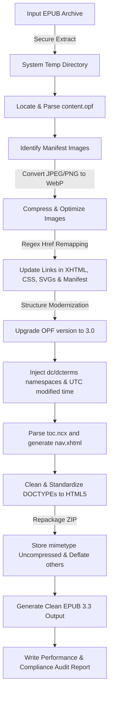

# 🚀 EPUB Version Booster (v3.3 Upgrade & WebP Optimizer)

[](https://www.gnu.org/licenses/agpl-3.0)
[](https://www.python.org/downloads/)
[](http://makeapullrequest.com)

An automated, standard-compliant command-line utility written in Python to optimize, modernize, and significantly shrink EPUB files. It seamlessly upgrades legacy EPUB structures (EPUB 2.0) to the modern **EPUB 3.3** specification while replacing heavy raster images (JPEG/PNG) with highly-compressed, modern **WebP** formats.

---

## ✨ Key Features

*   **🔒 Workspace Safety**: Extracts and processes files inside a system-managed secure temporary directory. The original file remains completely untouched unless the entire operations pipeline completes successfully.
*   **📸 WebP Image Optimization**:
    *   Automatically converts heavy JPEG and PNG images to WebP format.
    *   Preserves PNG alpha channel transparency.
    *   Allows customizable quality level settings (1–100).
    *   Automatically scans and updates all image references in CSS, XHTML/HTML files, SVG graphics, and the OPF manifest.
*   **⚡ EPUB 3.3 Compliance Upgrade**:
    *   Upgrades package declarations in the OPF metadata to version `3.0`.
    *   Injects required `dcterms:modified` UTC metadata timestamps.
    *   Parses legacy `toc.ncx` maps and generates a standard **EPUB 3 Navigation Document (`nav.xhtml`)** with clean nested elements.
    *   Converts outdated `<guide>` landmark reference lists into HTML5 `<nav epub:type="landmarks">` maps.
    *   Standardizes legacy XHTML DOCTYPEs (like XHTML 1.1) to modern HTML5 `<!DOCTYPE html>` structure.
*   **📊 Detailed Audit Reports**: Generates a detailed size comparison table and conversion metrics report in an easy-to-read text file.

---

## 🛠️ Technical Design & Pipeline

The diagram below outlines how the utility securely processes, converts, and repackages your EPUB books.



### 📱 E-Reader Compatibility
To ensure broad compatibility, the booster retains legacy `toc.ncx` maps and OPF pointers alongside the newly-generated EPUB 3.3 `nav.xhtml` navigation document. This creates a fully **backward-compatible** hybrid document that runs smoothly on vintage EPUB 2 devices while delivering high-speed modern features and layout compliance on new EPUB 3.3 devices.

---

## 📥 Installation

This utility requires **Python 3.6+** and the **Pillow** image processing library.

### 1. Set Up a Virtual Environment (Recommended)

To keep your system python packages clean:

```bash
# Create a virtual environment
python3 -m venv .venv

# Activate the virtual environment
# On macOS/Linux:
source .venv/bin/activate
# On Windows:
# .venv\Scripts\activate

# Install dependencies
pip install -r requirements.txt
```

### 2. Manual Dependency Installation

Alternatively, you can install Pillow directly:

```bash
pip install pillow
```

---

## 🚀 How to Use

### Basic Command

```bash
python3 epublift.py -i <path_to_input_epub>
```
*This command modernizes the input file and saves it in the same directory as `<input_name>_boosted.epub`, generating a performance report in `<input_name>_report.txt`.*

### Advanced Options

```bash
python3 epublift.py -i book.epub -o optimized_book.epub -q 85 -r stats_report.txt
```

### Command Line Interface Options

| Argument | Long Flag | Description | Default |
| :--- | :--- | :--- | :--- |
| `-i` | `--input` | **[Required]** Path to the original EPUB file | *None* |
| `-o` | `--output` | Path to save the modernized EPUB | `<input>_boosted.epub` |
| `-q` | `--quality`| WebP compression quality level (1-100) | `80` |
| `-r` | `--report` | Path to write the conversion audit report | `<input>_report.txt` |

---

## 🧪 Quick Sandbox Testing

We have included a test EPUB generator script to help you safely evaluate the ePubLifter. It builds a valid legacy EPUB 2.0 file containing heavy test images and outdated structures.

### Step 1: Generate the Sample EPUB 2.0 File
```bash
python3 test_epub_generator.py
```
*This creates a new legacy file named `sample_epub2.epub` in your root folder.*

### Step 2: Run the ePubLifter
```bash
python3 epublift.py -i sample_epub2.epub
```
*This converts the book, modernizes the structure to EPUB 3.3, and produces `sample_epub2_boosted.epub` along with `sample_epub2_report.txt`.*

### Step 3: Inspect the Output Audit Report
```bash
cat sample_epub2_report.txt
```

---

## 📄 License & Sharing

This project is licensed under the **GNU Affero General Public License, Version 3 (AGPL-3.0)**. 

### Why AGPL-3.0?
We believe in open source. By sharing this software under the AGPL license, we ensure that:
1. Anyone is free to use, modify, and distribute this tool.
2. If you modify this tool and run it as part of an online service (e.g. an e-book conversion website), you **must** make your modified source code available to users of that service.

For full terms and conditions, please consult the [LICENSE](https://github.com/bariskayadelen/epublift-py/blob/main/LICENSE) file in the root of this repository.
